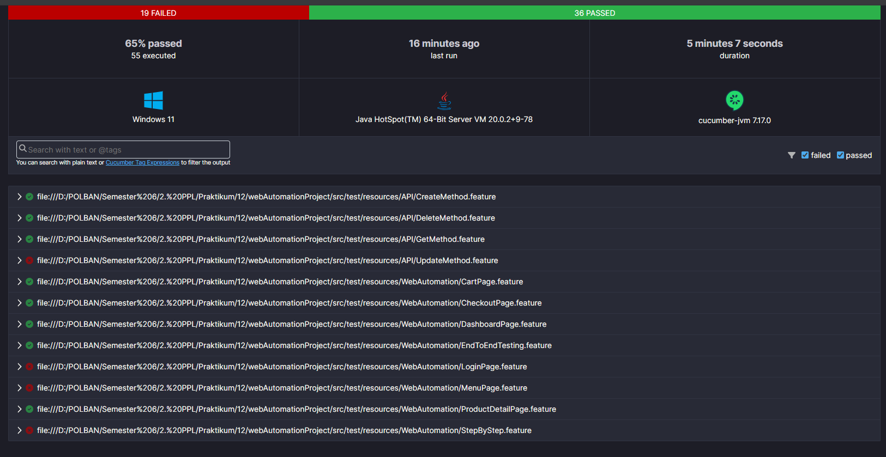

# Final Project Web Automation Testing dan API Testing By B3

## Daftar Isi
- [Deskripsi](#deskripsi)
- [Prasyarat](#prasyarat)
- [Cara Menjalankan](#cara-menjalankan)
- [Struktur Folder Project Setelah Program Dijalankan](#struktur-folder-project-setelah-program-dijalankan)
- [Pengujian dan Generate Report](#pengujian-dan-generate-report)
- [Pengembang](#pengembang)
- [Alat dan Teknologi yang Digunakan](#alat-dan-teknologi-yang-digunakan)

## Deskripsi
Proyek ini adalah aplikasi pengujian otomatis untuk Web Swag Labs (https://www.saucedemo.com/) menggunakan Java, Maven, Cucumber, Selenium, dan JUnit. Pengujian dilakukan untuk memastikan setiap fitur berjalan sesuai dengan spesifikasi requirement dan desainnya.

Proyek ini terdiri dari 5 bagian utama: 
1. **Feature:** Berisi file-file gherkin yang berisi skenario pengujian yang ditulis dalam bahasa manusia yang mudah dimengerti oleh semua pihak terlibat, termasuk pengembang, analis bisnis, dan penguji. Ini terdapat di `src/test/resources`
2. **StepDefinitions:** Berisi file-file yang terdapat definisi langkah-langkah (steps) yang sesuai dengan pernyataan-pernyataan dalam file fitur. Anotasi @Given, @When, dan @Then menandai langkah-langkah yang sesuai dengan langkah-langkah fitur.
3. **Actions:** Berisi file-file yang terdapat code interaksi atau operasi yang dilakukan pada elemen-elemen web.
4. **Locator:** Berisi file-file yang terdapat code untuk menemukan elemen di halaman web agar bisa diinteraksikan oleh skrip pengujian.
5. **Runner:** Berisi file untuk menjalankan web automation testing.

Terdapat 2 testing yang dilakukan di proyek ini:
1. **Web Automation Testing:** Pengujian otomatis dilakukan pada web Swag Labs (https://www.saucedemo.com/). Pengujian dilakukan untuk memastikan setiap fitur berjalan sesuai dengan spesifikasi requirement dan desainnya.
2. **API Testing:** Pengujian otomatis dilakukan pada User Controller API Dummy (https://dummyapi.io/). Pengujian dilakukan untuk memastikan setiap method API untuk User Controller berjalan sesuai dengan API Contract.

## Prasyarat

1. Pastikan untuk mengklon repository ini ke dalam direktori lokal Anda dengan perintah:
    ```
    git clone https://github.com/mentarialysias/FinalProjectAutomation.git
    ```
   Ini akan mendownload salinan proyek ke komputer Anda.

2. Pastikan Anda telah menginstal Java JDK versi 17. Anda dapat mengunduh dan menginstal Java JDK dari situs resminya: [Java SE Development Kit 16 Downloads](https://www.oracle.com/java/technologies/javase/jdk17-archive-downloads.html).

   Untuk memeriksa apakah Java JDK sudah terinstal, jalankan perintah berikut di terminal:
    ```
    java -version
    ``` 

3. Pastikan Anda telah menginstal Apache Maven. Maven adalah alat manajemen proyek yang digunakan untuk mengelola dependensi dan membangun proyek Java. Anda dapat mengunduh dan menginstal Maven dari situs resminya: [Apache Maven Download](https://maven.apache.org/download.cgi). 
 Untuk memeriksa apakah Maven sudah terinstal, jalankan perintah berikut di terminal:
     ```
    mvn -v
    ```

4. Pastikan Anda telah menginstal plugin `Cucumber for Java` dan `Gherkins` untuk mendukung pengujian otomatis. Bila Anda menggunakan IntelliJ, Anda bisa menginstalnya dari plugin dengan menggunakan shortcut `ctrl + alt + s`, lalu instal plugin yang diperlukan. Jangan lupa untuk merestart IDE setelah plugin berhasil ditambahkan.
   <br> 


## Cara Menjalankan

1. Buka proyek dengan IDE favorit Anda. Disarankan untuk menggunakan IntelliJ IDEA untuk kenyamanan pengembangan.

2. Lakukan build proyek untuk menyiapkan aplikasi dengan perintah build di IDE Anda atau dengan perintah:
    ```
    mvn clean install
    ```

3. Jalankan program untuk melakukan pengujian otomatis dengan perintah:
    ```
    mvn test
    ```
   Ini akan menjalankan program secara otomatis dan mengeksekusi skenario berdasarkan isi file test runner yaitu `CucumberRunnerTest.java`

## Struktur Folder Project Setelah Program Dijalankan
Berikut struktur folder project setelah program dijalankan hingga step npm test:
```
├── src
│   ├── ...
│   └── test
|       ├── java
|       |    ├── apiTesting.utils
|       |    │    └── HelperClass.java
|       │    ├── runner
|       │    │    └── cucumberRunnerTest.java
|       │    ├── stepdefinitions
|       │    │    ├── apiTesting
|       │    │    │    ├── CreateApiSteps.java
|       │    │    │    ├── DeleteApiSteps.java
|       │    │    │    ├── GetApiSteps.java
|       │    │    │    ├── Hooks.java
|       │    │    │    └── UpdateApiSteps.java
|       │    │    └── webAutomation
|       │    │         ├── CartPageSteps.java
|       │    │         ├── CheckoutPageSteps.java
|       │    │         ├── DashboardPageSteps.java
|       │    │         ├── DetailProductPageSteps.java   
|       │    │         ├── EndToEndTestingSteps.java
|       │    │         ├── Hooks.java
|       │    │         ├── LoginSteps.java
|       │    │         ├── MenuPageSteps.java
|       │    │         └── StepBySteps.java
|       │    └── webAutomation
|       │    │    ├── actions
|       │    │    │    ├── CartPageActions.java
|       │    │    │    ├── CheckoutCompletePageActions.java
|       │    │    │    ├── CheckoutInfoPageActions.java
|       │    │    │    ├── CheckoutOvwPageActions.java
|       │    │    │    ├── DashboardPageActions.java
|       │    │    │    ├── DetailProductPageActions.java
|       │    │    │    └── LoginPageActions.java
|       │    │    ├── locator
|       │    │    │    ├── CartPageLocator.java
|       │    │    │    ├── CheckoutCompletePageLocator.java
|       │    │    │    ├── CheckoutInfoPageLocator.java
|       │    │    │    ├── CheckoutOvwPageLocator.java
|       │    │    │    ├── DashboardPageLocator.java
|       │    │    │    ├── DetailProductPageLocator.java
|       │    │    │    └── LoginPageLocator.java
|       │    │    └── utils
|       │    │         ├── HelperClass.java
|       └── resource
|           ├── API
|           │    ├── CreateMethod.feature
|           │    ├── DeleteMethod.feature
|           │    ├── GetMethod.feature
|           │    └── UpdateMethod.feature
|           └── WebAutomation
|                ├── CartPage.feature
|                ├── CheckoutPage.feature
|                ├── DashboardPage.feature
|                ├── EndToEndTesting.feature
|                ├── LoginPage.feature
|                ├── MenuPage.feature
|                ├── ProductDetailPage.feature
|                └── StepByStep.feature

├── pom.xml
└── README.md
    
```

## Pengujian dan Generate Report
Pengujian dilakukan menggunakan JUnit. Laporan hasil pengujian akan digenerate secara otomatis. Laporan ini terletak pada folder `target` setelah pengujian otomatis dijalankan. Hasil pengujiannya sebagai berikut:
- Total test: <span style="color:#2196F3; font-weight:bold;">55</span>
- Successful: <span style="color:#4CAF50; font-weight:bold;">43 (65%)</span>
- Failures: <span style="color:#F44336; font-weight:bold;">12 (35%)</span>
- Igroned: <span style="color:#FFC107; font-weight:bold;">0</span>

<br> 

## Pengembang
[](https://github.com/delvitord)
[](https://github.com/mentarialysias)
[](https://github.com/yasminazizahtuhfah)


<b>Delvito Rahim Derivansyah - 211524039 ([@delvitord](https://github.com/delvitord))
<br> Mentari Ayu Alysia Sudrajat - 211524047 ([@mentarialysias](https://github.com/mentarialysias))
<br> Yasmin Azizah Tuhfah - 211524064 ([@yasminazizahtuhfah](https://github.com/yasminazizahtuhfah))
<b>
# Alat dan Teknologi yang Digunakan

1. 
   <br>Maven digunakan sebagai alat manajemen proyek untuk mengelola dependensi dan membangun proyek Java. Kunjungi [situs web Maven](https://maven.apache.org/) untuk informasi lebih lanjut.

2. 
   <br>JUnit adalah framework pengujian unit untuk bahasa pemrograman Java. Kunjungi [situs web JUnit](https://junit.org/junit5/) untuk informasi lebih lanjut.

3. 
   <br>Cucumber for Java adalah framework pengujian otomatis yang menggunakan bahasa Gherkin untuk menulis skenario pengujian. Kunjungi [situs web Cucumber](https://cucumber.io/docs/guides/10-minute-tutorial/) untuk informasi lebih lanjut.

4. 
      <br>Gherkin adalah bahasa alami yang digunakan untuk menulis skenario pengujian dalam kerangka kerja pengujian perilaku seperti Cucumber. Kunjungi [dokumentasi Cucumber](https://cucumber.io/docs/gherkin/) untuk informasi lebih lanjut.

4. 
   <br>Selenium adalah library untuk otomatisasi pengujian web. Kunjungi [situs web Selenium](https://www.selenium.dev/documentation/en/) untuk informasi lebih lanjut.

5. 
   <br>EdgeDriver adalah driver untuk mengotomatisasi pengujian di browser Microsoft Edge. Kunjungi [situs web Selenium](https://www.selenium.dev/documentation/en/) untuk informasi lebih lanjut.

6. 
    <br>RestAssured adalah library Java yang kuat untuk melakukan pengujian API secara otomatis. Dengan RestAssured, Anda dapat dengan mudah melakukan permintaan HTTP ke endpoint API, memeriksa respons, dan memvalidasi data JSON. Kunjungi dokumentasi RestAssured untuk informasi lebih lanjut.

7. 
    <br>Framework pengujian</span> yang digunakan untuk menulis dan menjalankan unit tes dalam proyek Java. Kunjungi [situs web TestNG](https://testng.org/) untuk informasi lebih lanjut.
